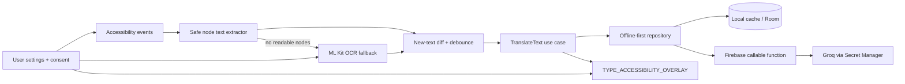

# LiveTranslate Pro

[](https://github.com/piyushkumarexe/LiveTranslate-Pro/actions/workflows/android-ci.yml)
[](LICENSE)

A system-wide Android live translation overlay. LiveTranslate Pro watches newly appearing visible text in the app currently on screen, translates it, and displays the result in a movable overlay—without requiring users to copy text, paste text, or switch applications.

> **Application ID:** `com.piyush.livetranslate`
>
> **Primary architecture:** Accessibility text extraction → debounced translation → accessibility overlay. OCR is a fallback, not the default capture path.

## System-wide behavior

1. The user reviews a prominent in-app disclosure and affirmatively allows screen-text translation.
2. The user enables **LiveTranslate screen translation** in Android Accessibility settings.
3. The service listens only for relevant window/content/text changes.
4. It traverses the active accessibility node tree and extracts newly visible, non-editable text.
5. New text is deduplicated and debounced before translation.
6. The translated result appears in a draggable `文` accessibility overlay above the current app.
7. If an app exposes no accessibility text, optional on-device ML Kit OCR can inspect a temporary screenshot on Android 11+.

There is no manual text-entry translator in the packaged navigation flow. The previous speech/text feature module is not included in the application build.

## Privacy and safety boundaries

- Accessibility access is disabled until the user completes a separate prominent disclosure and Android's system confirmation.
- `android:isAccessibilityTool` is explicitly `false`; this utility must complete the Accessibility API declaration in Play Console.
- The service never performs clicks, gestures, typing, scrolling, navigation, or autonomous UI actions.
- Editable fields, password nodes, OTP/security-code patterns, payment-card-like values, the lock/system UI, keyboards, permission surfaces, and this app's own UI are excluded.
- If any visible accessibility node is marked as a password, translation pauses for that screen.
- OCR runs on-device, hides the overlay during capture, rejects known sensitive patterns, discards the bitmap immediately, and cannot capture `FLAG_SECURE` windows.
- Overlay history is off by default. Users can pause, stop, disable, or revoke consent at any time.
- Recognized text—not screenshots—is sent to the configured translation backend. Groq credentials never ship in the APK.

Review [Accessibility Overlay Design](docs/ACCESSIBILITY_OVERLAY.md) and [Security Policy](SECURITY.md) before distribution.

## Overlay controls

- Drag the `文` bubble to reposition it.
- Tap the bubble to expand or collapse the result card.
- **Pause/Resume** stops and restarts observation immediately.
- **Scan** requests one OCR fallback scan.
- **Stop** disables the accessibility service.
- The app dashboard selects the target language and controls OCR/history preferences.

## Architecture



### Modules

```text
app                  Composition root, navigation, WorkManager, FCM
core:model           Immutable models and language catalog
core:common          Network/platform utilities
core:database        Room entities, DAOs, schema and migrations
auth/data            Firebase authentication and user/device profiles
data:translation     Provider boundary, cache, persistence and cloud sync
domain               Repository contracts and use cases
feature:overlay       Accessibility service, node extraction, OCR and overlay UI
feature:auth          Onboarding, disclosure-adjacent login flow
feature:home          Profile screen
feature:history       Search, favorites, delete, export and cloud sync
feature:settings      Privacy, appearance and account settings
functions             Secret-backed Firebase/Groq translation proxy
```

## Requirements

- Android 8.0+ (API 26) for accessibility-node translation
- Android 11+ (API 30) for Accessibility Service screenshot/OCR fallback
- JDK 17 and Android SDK 35 for builds
- Firebase project and Google Authentication for cloud translation
- Firebase Blaze plan for outbound Cloud Functions provider calls
- Node.js 20 and Firebase CLI for backend deployment

## Firebase setup

1. Register Android app `com.piyush.livetranslate` in Firebase.
2. Add debug/release SHA-1 and SHA-256 fingerprints.
3. Put the downloaded file at `app/google-services.json`—it is gitignored.
4. Enable Google Authentication, Firestore, Functions, Storage, Crashlytics, and Cloud Messaging.
5. Store Groq only in Firebase Secret Manager:

```bash
firebase functions:secrets:set GROQ_API_KEY
npm --prefix functions ci
npm --prefix functions run build
firebase deploy --only functions,firestore:rules,firestore:indexes,storage
```

The Android app calls an authenticated callable function. The backend validates inputs, prevents prompt instructions inside screen text from being executed, rate-limits by UID, and returns a structured translation response.

## Build

```bash
./gradlew --no-daemon testDebugUnitTest :core:model:test :domain:test lintDebug :app:assembleDebug
```

APK: `app/build/outputs/apk/debug/app-debug.apk`.

The GitHub Actions workflow performs the same checks on every push and uploads the Debug APK as a workflow artifact. It can compile a Firebase-safe configuration without `google-services.json`; cloud translation remains unavailable in that variant.

## Google Play release requirements

Accessibility Service is sensitive access. Before publishing:

- Complete the Accessibility API declaration accurately; do not claim the app is a disability accessibility tool.
- Include the system-wide translation behavior in the store listing.
- Provide the required demo video showing disclosure, consent, service enablement, overlay behavior, pause/stop, and data handling.
- Host a complete privacy policy and complete Data Safety disclosures.
- Verify the disclosure wording with current Play policy and legal/privacy review.
- Test banking, password, secure-window, keyboard, lock-screen, RTL, rotation, multi-window, and accessibility interaction behavior.

## Known platform limitations

- Some apps expose incomplete or no accessibility node text.
- Secure windows cannot be screenshotted and are intentionally not translated with OCR.
- OCR fallback is unavailable before Android 11 unless a future explicit MediaProjection flow is added.
- Accessibility overlays and service restart behavior vary by OEM battery/process management.
- Cloud latency depends on connectivity and backend region; local cache hits are faster.

## Documentation

- [Accessibility Overlay](docs/ACCESSIBILITY_OVERLAY.md)
- [Architecture](docs/ARCHITECTURE.md)
- [Authentication](docs/AUTHENTICATION.md)
- [Database](docs/DATABASE.md)
- [Setup](docs/SETUP.md)
- [Contributing](CONTRIBUTING.md)
- [Security](SECURITY.md)

## License

MIT © 2026 Piyush. See [LICENSE](LICENSE).
