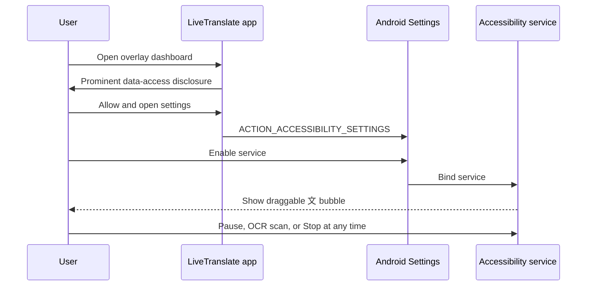

# Accessibility Overlay Design

## Purpose

The Accessibility Service exists solely to provide user-requested, system-wide screen-text translation. It observes visible text and renders translations. It does not automate or interact with another application's controls.

## Consent and lifecycle

Consent is persisted locally. If Android starts the service without application consent, the service does not inspect the active window and asks the user to return to the app. Revoking consent sends a stop command.

## Accessibility-first extraction

The service handles window state/content, text change/selection, scroll, and windows-changed events. Events are debounced. For each eligible active package:

1. Traverse at most 700 visible nodes and 40 levels.
2. Stop processing password nodes and skip all editable-node text.
3. Normalize whitespace and reject strings without letters.
4. Reject OTP/security-code and payment-card-like patterns.
5. Compare the current set with the prior visible set.
6. Translate only newly visible strings, capped at eight strings/1,500 characters.
7. Throttle translation submissions and retain only the latest pending screen change.

The app excludes its own package, system UI/lock surfaces, Android Settings, permission controller, and common keyboards. This list is defense-in-depth; node and content filtering still applies.

## OCR fallback

OCR is optional and off when the user disables it. Automatic OCR runs only when the current app exposes no accessibility root/text, with a minimum three-second interval. Users can also press **OCR scan**.

On Android 11+, `AccessibilityService.takeScreenshot()` provides a hardware buffer. The overlay is hidden before capture. A software bitmap is created, the hardware buffer is closed, ML Kit processes the image on-device, sensitive-looking lines are removed, and the bitmap is recycled. Only recognized text is submitted for translation. Screenshot failure on secure windows is treated as an expected privacy boundary.

Android 8–10 continue to use accessibility text but do not use screenshot OCR. A future MediaProjection implementation would require a separate explicit system capture consent and foreground-service lifecycle.

## Overlay window

`TYPE_ACCESSIBILITY_OVERLAY` is used rather than `SYSTEM_ALERT_WINDOW`, so no draw-over-other-apps permission is requested. The window is non-focusable and does not cover the full screen. A small draggable bubble expands a translation card containing:

- source preview
- translated text
- extraction source (Accessibility or OCR)
- pause/resume
- manual OCR scan
- stop service

## Data handling

Overlay history is disabled by default. Translation text follows the same authenticated Firebase callable-function path as other translations. The Groq key remains in Firebase Secret Manager. Screenshots never leave the device and are not written to storage.

## Play policy checklist

- `isAccessibilityTool=false`
- separate in-app prominent disclosure
- affirmative user action before opening settings
- accurate Accessibility API declaration
- no autonomous actions or UI manipulation
- no credential collection
- data minimization and user-visible stop controls
- store listing, privacy policy, Data Safety form, and demo video aligned with actual behavior
