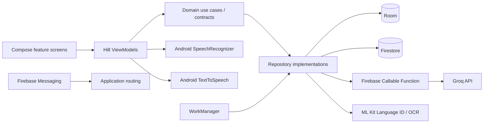
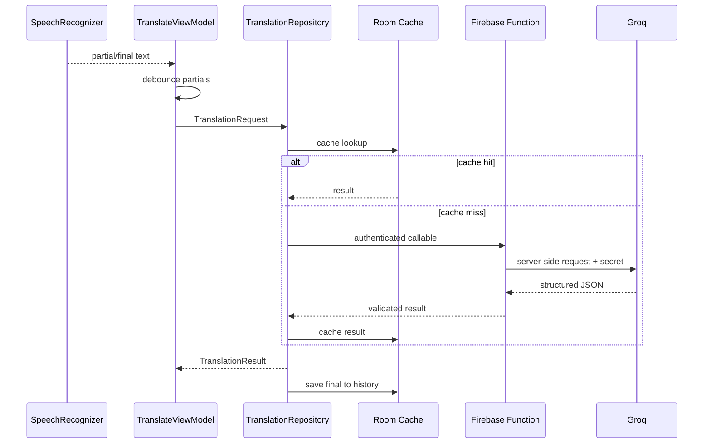

# Architecture

LiveTranslate Pro uses feature modules around a unidirectional UI flow. The Android app treats Room as its local source of truth and Firebase as an authenticated synchronization/backend boundary.

## Dependency rule

- `core:model` has no Android dependency.
- `domain` depends only on shared models and coroutines.
- data modules implement domain contracts.
- feature modules consume contracts, not concrete repositories.
- `app` is the composition and navigation root.

The exception is platform UI integration required directly by a feature (Credential Manager and ML Kit OCR input). Platform engines still sit behind domain interfaces where reusable behavior is needed.

## Translation sequence

## Synchronization

1. Save local translations/favorites with `PENDING` state.
2. Enqueue unique connected-network work.
3. Upload pending rows with ownership metadata.
4. Mark uploaded local rows `SYNCED`.
5. Pull the latest user-owned cloud snapshot and merge by stable UUID.
6. Firestore's native persistence additionally queues writes while offline.

For very large datasets, replace the bounded snapshot with cursor-based delta synchronization and explicit deletion tombstones.

## Security boundaries

- Groq secret: Firebase Secret Manager only.
- Identity: Firebase ID token on callable requests.
- Authorization: Firestore/Storage ownership rules.
- Device identifier: one-way SHA-256 hash, truncated for document addressing.
- Local database: app-private sandbox; no backup. Add SQLCipher if the threat model requires database-at-rest encryption beyond Android file-based encryption.
