# Architecture

LiveTranslate Pro follows modular Clean Architecture with a system-wide accessibility overlay as the primary presentation surface.

```mermaid
flowchart TB
  subgraph System-wide presentation
    AE[Accessibility events]
    EX[Safe node extractor]
    OCR[ML Kit OCR fallback]
    OW[Accessibility overlay window]
    AE --> EX
    EX --> OCR
  end
  subgraph Domain
    VM[Overlay control ViewModel]
    UC[TranslateText use case]
    RI[Repository interfaces]
    VM --> RI
    EX --> UC
    OCR --> UC
    UC --> RI
  end
  subgraph Data
    TR[Translation repository]
    DB[(Room)]
    FF[Firebase callable function]
    TR --> DB
    TR --> FF
  end
  RI --> TR
  UC --> OW
  FF --> GP[Groq provider]
```

## Dependency rule

Feature modules depend on domain contracts, core models, and reusable UI. Domain contains no Android or Firebase dependency. Data modules implement repository contracts. Hilt assembles the graph in the application process and injects both Compose ViewModels and the Accessibility Service.

## Runtime state

`OverlayRuntimeController` is a process-scoped bridge between the service and dashboard. It exposes immutable `StateFlow` status and a bounded command flow for pause, OCR scan, and stop. Persistent consent/preferences live in Room-backed `SettingsRepository`; service status is deliberately ephemeral.

## Translation pipeline

Screen events are filtered, node trees are bounded, new text is diffed, submissions are debounced/throttled, and the latest pending update wins. `TranslateTextUseCase` delegates to an offline-first repository with a local response cache and optional history. Provider calls go through Firebase Functions, keeping provider credentials out of the APK.

## Database migration

Schema v2 adds local-only overlay consent, target language, OCR fallback, and history preferences. `MIGRATION_1_2` preserves existing settings and applies privacy-preserving defaults: no consent and no overlay history.
