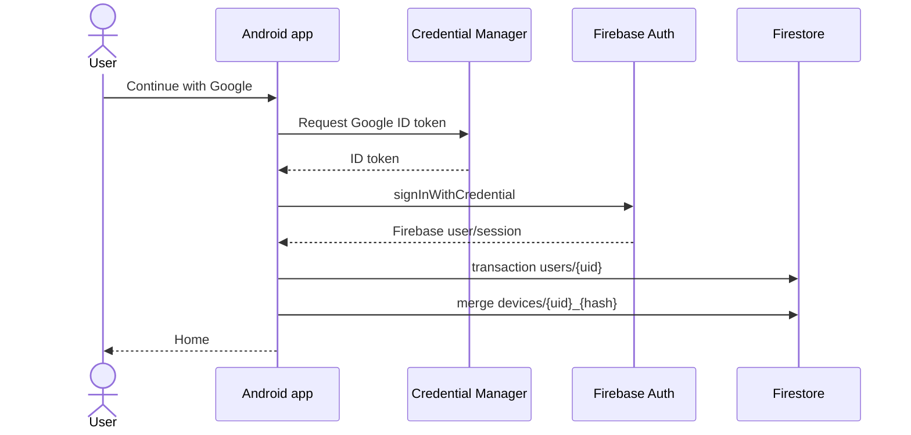

# Authentication flow

- Firebase Auth persists and restores the session automatically.
- `AuthStateListener` is exposed as a Flow for reactive UI.
- First login sets `createdTime`; every login updates `lastLogin`.
- Logout clears the Firebase Auth session.
- Offline mode is supported without a cloud identity; cloud translation itself requires sign-in because the Callable Function rejects unauthenticated traffic.

## Google Cloud configuration

1. Enable Google as a Firebase Auth provider.
2. Add SHA-1 and SHA-256 fingerprints for debug and release signing certificates.
3. Register the application ID and add fingerprints for both debug and release signing keys.
4. Download a fresh `google-services.json` after OAuth configuration changes.
5. Verify a web OAuth client (`client_type: 3`) exists; Gradle extracts its client ID automatically.

Never hardcode the web client ID in Kotlin. It is not a secret, but keeping it generated prevents environment drift.
