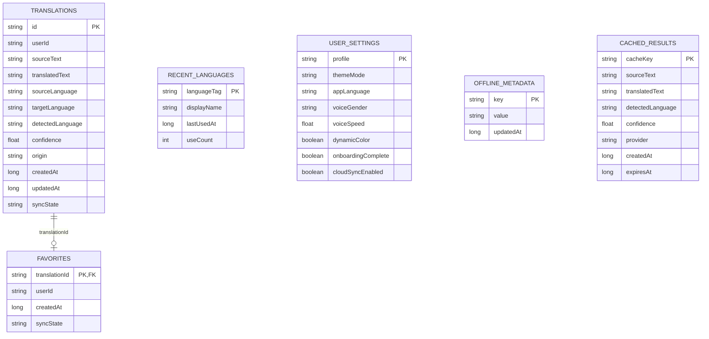

# Database design

## Room



Room schema JSON is exported under `core/database/schemas` during builds. Every future schema change must include an explicit migration and migration tests before release.

## Firestore

All user data is stored in top-level collections to support direct ownership queries:

```text
users/{uid}
translations/{translationId}
favorites/{uid}_{translationId}
settings/{uid}
devices/{uid}_{hashedDeviceId}
rateLimits/{uid}                  # server-only
```

Each mutable user-owned document carries `userId`. Security rules check both existing and incoming ownership, preventing ownership transfer. The Functions Admin SDK alone accesses `rateLimits`.

## Retention

- Cached AI results expire logically after 30 days and are pruned/cleared locally.
- History persists until the user deletes it.
- Device/FCM entries should be removed with an account-deletion backend in a production deployment.
